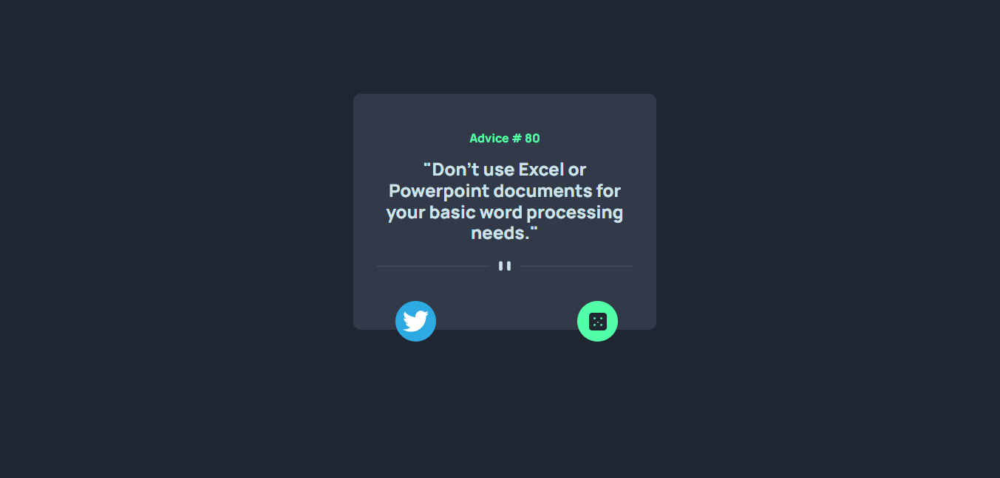

# ADVICE GENERATOR APP

## Table of contents

- [Overview](#overview)
  - [The challenge](#the-challenge)
  - [Built with](#built-with)
- [Author](#author)

## Overview

### The challenge

Users should be able to:

- View the optimal layout for the app depending on their device's screen size
- See hover states for all interactive elements on the page
- Generate a new piece of advice by clicking the dice icon

### Screenshot

### Built with

- Semantic HTML5 markup
- CSS custom properties
- BOOTSTRAP 5
- Mobile-first workflow
- [React](https://reactjs.org/) - JS library

## Author

- Website - [HENRY]
- Twitter - [@Ray_dev67](https://www.twitter.com/Ray_dev67)

